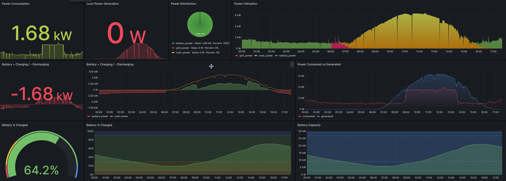

# tesla-api-prometheus-exporter
Prometheus exporter for Tesla API metrics

Example Grafana dashboard [grafana_dash.json]


# Build & run

## Local npm

Create an `auth.json` file in the config path (ex: `.config/auth.json`) containing at-least a valid refresh token.
The script will populate access token and future refresh tokens in that file as needed.

```
{
  "refresh_token": "<REDACTED>"
}
```

Ensure the script has access to CONFIG_PATH environment variable pointing to the the folder containing `auth.json`. Example `.env` file to accomplish this:

```
CONFIG_PATH=.config
```

Install and run

```
npm install
npm start
```

## Docker container

```
docker build -t tesla-api-prometheus-exporter:latest .
```

```
docker run -dit --restart unless-stopped --name tesla-api-prometheus-exporter \
  -v .config:/config \
  -e CONFIG_PATH=/config -p 9004:8080 \
  tesla-api-prometheus-exporter:latest
```
